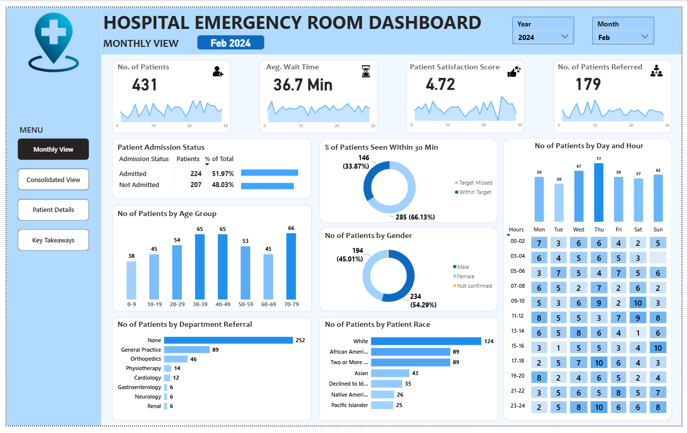
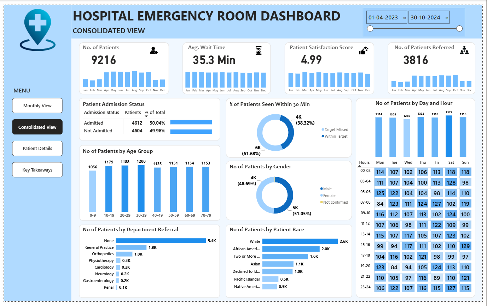
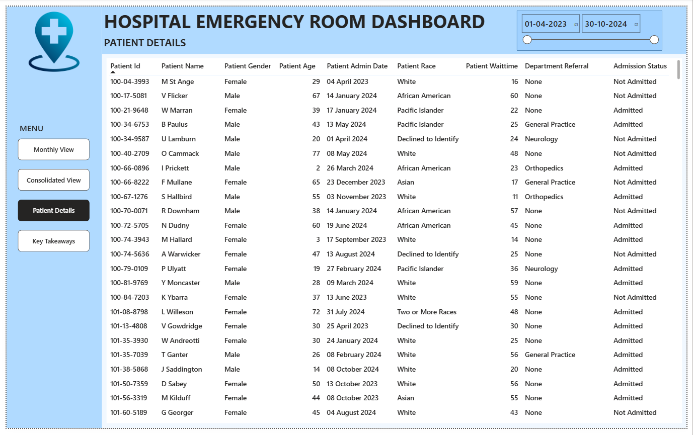
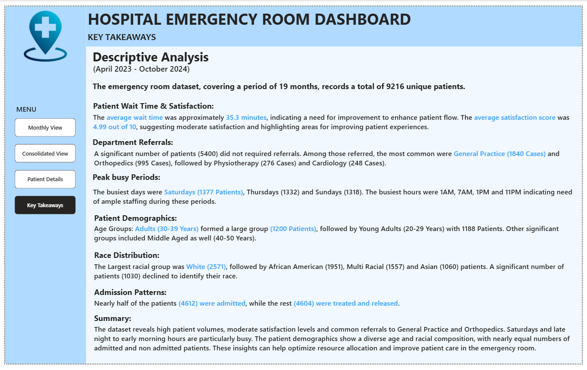

# hospital-emergency-room-analytics
Interactive Power BI dashboard analyzing hospital emergency room patient volume, waiting time, satisfaction, admissions, referrals, and demographics.
# 🏥 Hospital Emergency Room Analytics Dashboard

## 📊 Project Overview

This project presents an interactive Hospital Emergency Room Analytics
Dashboard built using Microsoft Power BI.

The dashboard analyzes emergency room patient data to understand patient
volume, waiting time, satisfaction, admissions, referrals, demographics,
and peak periods.

The report contains four interactive pages:

- Monthly View
- Consolidated View
- Patient Details
- Key Takeaways

---

## 🎯 Business Objective

The objective of this project is to analyze emergency room operations
and provide insights into:

- Patient volume and admission patterns
- Average patient waiting time
- Patient satisfaction
- Department referrals
- Patient demographics
- Peak days and hours
- Patient race distribution
- Monthly trends
- Emergency room operational patterns

---

## 📅 Data Coverage

The dashboard analyzes emergency room data covering:

**April 2023 – October 2024**

The dataset contains approximately:

**9,216 unique patients**

---

## 🔍 Key Business Questions

The dashboard was designed to answer questions such as:

1. How many patients visit the emergency room?
2. What is the average patient waiting time?
3. How satisfied are patients with their emergency room experience?
4. What percentage of patients are seen within 30 minutes?
5. Which days have the highest patient volumes?
6. Which hours experience the highest patient demand?
7. Which age groups account for the largest number of patients?
8. What is the distribution of patients by gender?
9. Which departments receive the most referrals?
10. What are the admission patterns?
11. How does patient volume change over time?
12. What demographic patterns can be observed?

---

## 📈 Dashboard Pages

## 1. Monthly View

The Monthly View provides a detailed analysis of emergency room activity
for a selected month and year.

### Key KPIs

- Number of Patients
- Average Waiting Time
- Patient Satisfaction Score
- Number of Patients Referred

### Visual Analysis

- Patient Admission Status
- Percentage of Patients Seen Within 30 Minutes
- Patients by Day and Hour
- Patients by Age Group
- Patients by Gender
- Patients by Department Referral
- Patients by Race

Users can select the year and month to analyze monthly performance.

---

## 2. Consolidated View

The Consolidated View provides an overall analysis across the available
date range.

### Key KPIs

- Total Patients
- Average Waiting Time
- Patient Satisfaction Score
- Total Patients Referred

### Analysis

- Monthly patient volume
- Monthly waiting time
- Monthly satisfaction
- Monthly referrals
- Admission status
- Patients seen within 30 minutes
- Age distribution
- Gender distribution
- Department referrals
- Race distribution
- Patients by day and hour

A date-range filter allows users to analyze different periods.

---

## 3. Patient Details

The Patient Details page provides a detailed patient-level view.

The table contains information such as:

- Patient ID
- Patient Name
- Gender
- Age
- Admission Date
- Race
- Waiting Time
- Department Referral
- Admission Status

Date filters can be used to analyze patients within a selected period.

---

## 4. Key Takeaways

The Key Takeaways page summarizes the major findings from the analysis.

### Patient Volume

The dataset contains approximately 9,216 unique patients across the
April 2023 – October 2024 period.

### Waiting Time & Satisfaction

The average patient waiting time is approximately 35.3 minutes,
while the overall patient satisfaction score is approximately 4.99.

### Department Referrals

A large number of patients did not require a department referral.
Among referred patients, General Practice and Orthopedics represent
major referral categories.

### Peak Periods

The analysis identifies specific days and hours with higher patient
volumes, which can help understand emergency room demand patterns.

### Patient Demographics

The dashboard analyzes patient distribution across age groups,
gender, and race categories.

### Admission Patterns

The dashboard compares admitted and non-admitted patients to identify
overall admission patterns.

---

## 💡 Key Insights

The analysis indicates:

- Emergency room activity varies across months, days, and hours.
- Patient waiting time is an important operational metric.
- Patient satisfaction can be analyzed alongside waiting time.
- General Practice represents a significant referral category.
- Patient volumes vary across age groups.
- The dashboard provides visibility into admission and referral patterns.
- Peak periods can be identified to support emergency room resource
  planning.

  ---

## 📊 Power BI Features Used

The dashboard incorporates several Power BI features:

- Interactive slicers
- Date filters
- KPI cards
- Bar charts
- Donut charts
- Matrix/table visualizations
- Conditional formatting
- Page navigation buttons
- Interactive visual filtering
- Data modeling
- DAX measures
- Power Query transformations

---

## 🛠️ Tools & Technologies

- Microsoft Power BI
- DAX
- Power Query
- Data Modeling
- Data Visualization

---

## 👤 Project Type

**Data Analytics / Business Intelligence**  

**Domain:** Healthcare / Hospital Operations  

**Primary Tool:** Microsoft Power BI
